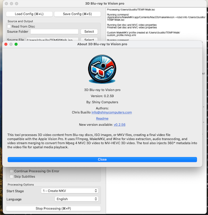
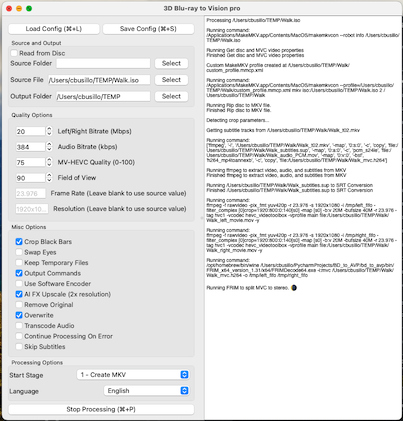

# BD-to-AVP 3D Blu-ray Disc to Apple Vision Pro README

## Introduction

This tool processes 3D video content from Blu-ray discs, ISO images, MKV files, or mts files, creating a final video
file compatible with the Apple Vision Pro. It uses FFmpeg, MakeMKV, and Wine for video extraction, audio transcoding,
and video stream merging to convert from Mpeg 4 MVC 3D video to MV-HEVC 3D video. The tool also injects 360° metadata
into the video file for spatial media playback. You have the option of AI upscaling the video to 4K resolution and AI
OCR of subtitles. The videos will play directly in the Files app on the AVP.

## Screenshots

[](screenshots/main.png)
[](screenshots/about.png)

## GUI install

To install the GUI version of `Blu-ray to Vision Pro`, download the latest release from the [releases page]. Open the
DMG file and drag the app to your Applications folder. On the first run of the app you will be prompted for your
password to install the necessary dependencies. It will appear to be doing nothing for around ten minutes. After that it
will open to the GUI or give you an error. If you receive an error, please open an issue, so I can help.

## Terminal install or update (See releases for GUI version)

To quickly install or update `BD_to_AVP`, run the following command in your terminal:

```bash
/bin/bash -c "$(curl -fsSL https://raw.githubusercontent.com/cbusillo/BD_to_AVP/release/installer.sh)"
```

## Prerequisites

Ensure the following are installed on your Mac *(If not using the Quick Install or GUI)*:

- **Apple Silicon [Mac]**: A Mac with Apple Silicon, such as the M1, M1 Pro, or M1 Max
- **[macOS Sonoma]**: The latest version of macOS.
- **[Rosetta 2]**: A compatibility layer allowing Intel-based applications to run on Apple Silicon Macs.
- **[Python] 3.12**: The latest version of Python.
- **[Homebrew]**: The missing package manager for macOS (or Linux).
- **[FFmpeg]**: A complete, cross-platform solution to record, convert, and stream audio and video.
- **[Wine]**: A free and open-source compatibility layer allowing Windows programs to run on Unix-like operating
  systems.
- **[MakeMKV]**: For converting disc video content into MKV files.
- **[spatial-media-kit-tool]**: A tool for injecting 360° metadata into video files.
- **[MP4Box]**: A multimedia packager available for Windows, Mac, and Linux.
- **[MKVToolNix]**: A set of tools to create, alter, and inspect Matroska files.

## Manual Installation (Out of date)

To set up your macOS environment for video processing, including creating and handling 3D video content, follow these
steps to install the necessary tools using Homebrew and manual installation. This includes the installation of Homebrew
itself,FFmpeg for video encoding and decoding, Wine for running Windows applications, MakeMKV for ripping Blu-ray and
DVD to MKV, spatial-media-kit-tool for handling spatial media, and MP4Box for multimedia packaging.

```bash
# Install Rosetta 2
/usr/sbin/softwareupdate --install-rosetta --agree-to-license

# Install Homebrew
/bin/bash -c "$(curl -fsSL https://raw.githubusercontent.com/Homebrew/install/HEAD/install.sh)"

# Install FFmpeg, MakeMKV, MP4Box, mkvtoolnix and Python 3.12
brew install ffmpeg makemkv mp4box mkvtoolnix python@3.12 --no-quarantine 

# Install Wine
brew tap homebrew/cask-versions
brew install --cask --no-quarantine wine-stable

# Ensure Python 3.12 is correctly installed then create a virtual environment
python3.12 -m pip install --upgrade pip
python3.12 -m venv ~/.bd_to_avp_venv

# Activate the virtual environment and install BD_to_AVP
source ~/.bd_to_avp_venv/bin/activate
pip install bd_to_avp

# Create a symbolic link to the bd-to-avp command
ln -s ~/.bd_to_avp_venv/bin/bd-to-avp /opt/homebrew/bin/bd-to-avp
```

## GUI Usage

If you have installed the terminal version and wish to use the GUI version, you can run the following command in your
terminal:

```bash
bd-to-avp
```

As long as you provide no arguments, the GUI will open.

## Terminal Usage

Navigate to the tool's directory in your terminal and execute the command with the required and optional parameters:

### Command Syntax

```bash
bd-to-avp --source <source> [--source-folder <source-folder>] [options]
```

### Parameters

- `--source`: Source for a single disc number, MKV file path, or ISO image path (required).
- `--source-folder`: Source folder path. This option will recurively scan for image files or mkv files. Will take
  precedence over --source if both are provided.
- `--fx-upscale`: Upscale video to 4K resolution using fx-upscale (disabled by default).
- `--remove-original`: Remove original file after processing.
- `--overwrite`: Overwrite existing output file.
- `--keep-files`: Keep intermediate files (disabled by default).
- `--output-root-folder`: Output folder path. Defaults to the current directory.
- `--transcode-audio`: Enable audio transcoding to AAC (disabled by default).
- `--audio-bitrate`: Audio bitrate for transcoding in kb/s do not include unit (default: "384").
- `--left-right-bitrate`: Bitrate for left and right views in Mb/s do not include unit (default: "20").
- `--mv-hevc-quality`: Quality factor for MV-HEVC encoding (default: "75").
- `--fov`: Horizontal field of view for MV-HEVC (default: "90").
- `--frame-rate`: Video frame rate (auto-detected if not provided).
- `--resolution`: Video resolution (auto-detected if not provided).
- `--swap-eyes`: Swap left and right views (disabled by default).
- `--start-stage`: Start processing at a specific stage.
- `--output-commands`: Output commands used to console.
- `--software-encoder`: Use software encoder for MV-HEVC encoding (disabled by default).
- `--skip-subtitles`: Skip subtitle extraction (disabled by default).
- `--continue-on-error`: Continue processing after an error (disabled by default).
- `--language`: Language code for audio and subtitle extraction (default: "eng")  Use the ISO 639-2 (three character)
  code.
- `--remove-extra-languages`: Remove extra audio and subtitle languages (disabled by default).
- `--version`: Show the version number and exit.

#### Stage Names

- CREATE_MKV
- EXTRACT_MVC_AUDIO_AND_SUB
- CREATE_LEFT_RIGHT_FILES
- UPSCALE_VIDEO
- COMBINE_TO_MV_HEVC
- TRANSCODE_AUDIO
- CREATE_FINAL_FILE
- MOVE_FILES

### Examples

Process a Blu-ray disc:

```bash
bd-to-avp --source disc:0 --output-root-folder /path/to/output
```

Process an ISO image:

```bash
bd-to-avp --source /path/to/movie.iso --output-root-folder /path/to/output
```

Process an MKV file:

```bash
bd-to-avp --source /path/to/movie.mkv --output-root-folder /path/to/output --transcode-audio
```

## Contribution

Contribute to the project by submitting pull requests or opening issues for bugs and feature requests.

## Acknowledgements

Big thanks to:

- [sturmen][sturmen] on the Doom9 forums, for [an encoding guide][sturmen-guide] using `FRIM Decoder` as well as
  creating
  the [spatial-media-kit-tool]
- [Vargol][vargol] on GitHub, for making
  the [JM reference software][jm-reference] [build properly on macOS][vargol-tools] as well as
  an [example script][vargol-guide] that was a useful reference
- [steverice][steverice] for [h264-tools][ldecod]

[MakeMKV]: https://www.makemkv.com/

[FFmpeg]: https://ffmpeg.org/

[jm-reference]: https://iphome.hhi.de/suehring/

[ldecod]: https://github.com/steverice/h264-tools

[spatial-media-kit-tool]: https://github.com/sturmen/SpatialMediaKit

[MP4Box]: https://github.com/gpac/gpac/wiki/MP4Box

[sturmen]: https://forum.doom9.org/member.php?u=224594

[sturmen-guide]: https://forum.doom9.org/showthread.php?p=1996846#post1996846

[vargol]: https://github.com/Vargol

[vargol-tools]: https://github.com/Vargol/h264-tools

[vargol-guide]: https://github.com/Vargol/h264-tools/wiki/Conversion-script-for-MVC-3D-blu-ray-extracted-by--MakeMKV

[steverice]: https://github.com/steverice

[h264-tools]: https://github.com/steverice/h264-tools

[Wine]: https://www.winehq.org/

[Homebrew]: https://brew.sh/

[Python]: https://www.python.org/

[Mac]: https://www.apple.com/mac/

[macOS Sonoma]:https://apps.apple.com/us/app/macos-sonoma/id6450717509?mt=12

[Rosetta 2]: https://support.apple.com/en-us/HT211861

[MKVToolNix]: https://mkvtoolnix.download/

[releases page]: https://github.com/cbusillo/BD_to_AVP/releases
