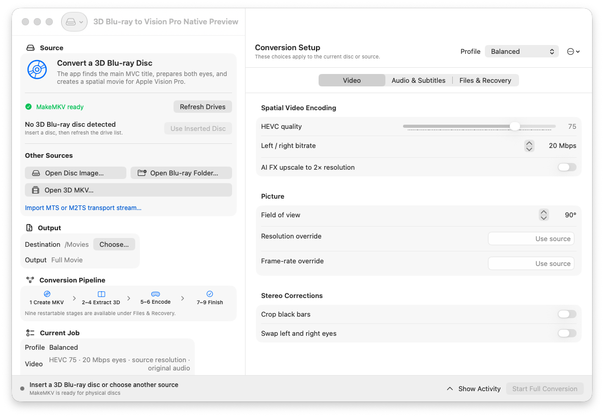
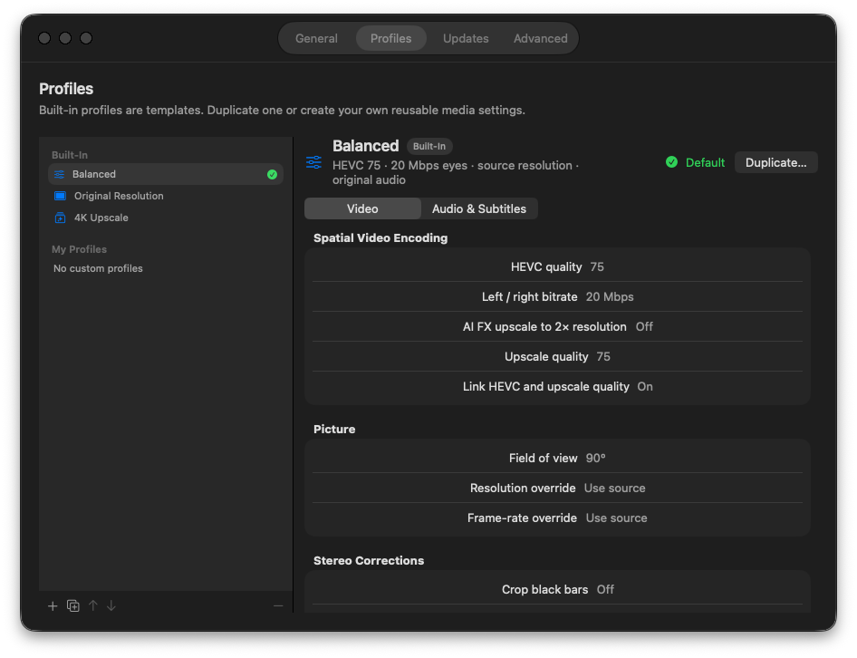

# BD-to-AVP 3D Blu-ray Disc to Apple Vision Pro README

## Introduction

This tool processes 3D video content from Blu-ray discs, ISO images, MKV files, or mts files, creating a final video
file compatible with the Apple Vision Pro. It uses FFmpeg, MakeMKV, and a bundled native MVC decoder helper for video
extraction, audio transcoding, and video stream merging to convert from Mpeg 4 MVC 3D video to MV-HEVC 3D video. The
tool also injects 360° metadata
into the video file for spatial media playback. You have the option of AI upscaling the video to 4K resolution and AI
OCR of subtitles. MV-HEVC remains the default native Apple spatial output; an opt-in software AV1 mode produces a
full-resolution side-by-side stereo MOV for storage-conscious and custom-playback workflows.

The default MV-HEVC videos play directly in the Files or
[Screenlit](https://apps.apple.com/us/app/screenlit/id6499478407) app on the AVP.
AV1 stereo playback depends on the device generation and player; see the
feasibility record before choosing it for headset delivery.

## Screenshots

[](docs/images/native-ui-acceptance/main-empty-light.png)
[](docs/images/native-ui-acceptance/profiles-dark.png)

## GUI install

To install the GUI version of `Blu-ray to Vision Pro`, download the latest release from the [releases page]. Open the
DMG file and drag the app to your Applications folder.

The GUI app does not install Homebrew or modify your shell setup. Runtime tools are bundled into the app where possible.
MakeMKV remains an external requirement for reading Blu-ray discs; install the current macOS version from the
[MakeMKV] website before converting discs.

The production interface starting with the `0.3.0` release line requires Apple
Silicon and macOS 26 or later. Stable `0.2.143` remains the last desktop build
for macOS 14 through 25.

See [Distribution Policy](docs/distribution-policy.md) for the current GUI
release artifact and dependency policy.

See [Direct Pipeline Contracts](docs/direct-pipeline-contracts.md) for the
automatic minimum-materialization behavior and the durable `--keep-files`
stage contracts.

See [AV1 Stereo Feasibility](docs/av1-stereo-feasibility.md) for the
standards evidence, Apple metadata probe, and boundaries between native
MV-HEVC spatial output and software AV1 stereo export.

## Terminal install or update (power users)

The formula in the custom third-party `cbusillo/tap` repository is the preferred terminal install. It installs the
locked CLI dependencies and FFmpeg while intentionally omitting the PySide6 GUI. Use the signed release DMG for the
desktop app.

### Custom Homebrew tap

```bash
brew tap cbusillo/tap
brew trust cbusillo/tap
brew install bd-to-avp
bd-to-avp --help
```

MakeMKV remains a separate optional install for Blu-ray disc input. Install the current macOS version from the
[MakeMKV] website; existing MKV, MTS, and M2TS sources do not require it.

The manual PyPI path remains available for power users who prefer to manage their own Python environment and FFmpeg.

## Prerequisites

Ensure the following are installed on your Mac *(if using the terminal/PyPI version)*:

- **Apple Silicon [Mac]**: A Mac with Apple Silicon, such as the M1, M1 Pro, or M1 Max
- **[macOS Sonoma]**: macOS 14 or later.
- **[Python] 3.12**: The supported Python runtime for the PyPI package.
- **[Homebrew]**: The missing package manager for macOS (or Linux).
- **[FFmpeg]**: A complete, cross-platform solution to record, convert, and stream audio and video.
- **[MakeMKV]**: Required only for reading Blu-ray discs and extracting titles.

Current release note: BD_to_AVP still uses MakeMKV for Blu-ray title extraction. By default, existing MKV/MTS/M2TS
sources are reused in place, MVC video streams directly into the bundled native Apple Silicon splitter, and AAC
transcoding avoids an intermediate PCM file. `--keep-files` restores the durable source copy, extracted MVC `.h264`,
and PCM boundaries for inspection, stage resume, and external workflows. Native MVC splitting supports 8-bit Blu-ray
3D MVC sources only. Disc image sources using durable MVC input are probed for up to 30 seconds before splitting; if
the multi-threaded native splitter is unstable for that stream, BD_to_AVP continues in slower single-threaded mode.

Runtime tool lookup prefers explicit `BD_TO_AVP_<TOOL>_PATH` environment overrides, bundled tools in `bd_to_avp/bin`,
tools already available in `PATH`, and finally the legacy `/opt/homebrew/bin` location. The GUI app uses bundled tools
where available; the terminal/PyPI version still expects power users to install command-line tools themselves.

## Manual terminal/PyPI dependency setup

These steps are for terminal/PyPI users who manage their own command-line tools. GUI users should use the release DMG
and install MakeMKV from the [MakeMKV] website.

```bash
# Install Homebrew
/bin/bash -c "$(curl -fsSL https://raw.githubusercontent.com/Homebrew/install/HEAD/install.sh)"

# Install the external command-line dependencies.
brew install ffmpeg python@3.12

# Install the current macOS MakeMKV build from https://www.makemkv.com/.
# The app bundle is detected automatically from /Applications/MakeMKV.app.

# Ensure Python 3.12 is correctly installed then create a virtual environment
python3.12 -m pip install --upgrade pip
python3.12 -m venv ~/.bd_to_avp_venv

# Activate the virtual environment and install BD_to_AVP
source ~/.bd_to_avp_venv/bin/activate
pip install bd_to_avp

# Run the command from the virtual environment
bd-to-avp --help
```

## PyPI GUI extra

The signed release DMG is the supported GUI install. PyPI users who intentionally want the legacy Python GUI can add
the optional dependency and then launch without arguments:

```bash
pip install "bd_to_avp[gui]"
bd-to-avp
```

As long as you provide no arguments, the GUI will open.

The GUI locks configuration load/save actions while a job is active so each
run uses the settings captured at startup. Choosing **Stop Processing**
requests a cooperative stop and keeps the button in a stopping state until the
worker exits. When a disc, ISO, or Blu-ray folder contains multiple MVC titles,
the macOS app can convert the main movie, every detected 3D video, or a custom
selection. Multi-title selections run serially and preserve completed outputs
if a later video needs attention. For source-folder jobs, accepted MKV or subtitle error
continuations resume the failed source and then continue through the original
batch queue.

## Terminal Usage

Navigate to the tool's directory in your terminal and execute the command with the required and optional parameters:

### Command Syntax

```bash
bd-to-avp --source <source> [--source-folder <source-folder>] [options]
```

### Parameters

- `--source`: Source for a single disc number, MKV file path, or ISO image path (required).
- `--source-folder`: Source folder path. This option will recurively scan for image files or mkv files. Will take
  precedence over --source if both are provided.
- `--fx-upscale`: Upscale video to 4K resolution using fx-upscale (disabled by default).
- `--remove-original`: Remove the original source after processing completes successfully.
- `--overwrite`: Overwrite existing output file.
- `--keep-files`: Use durable stage boundaries and keep retained intermediates. This affects retention only; it does
  not change the selected audio policy. An explicit `--remove-original` still removes the selected source after a
  successful conversion.
- `--output-root-folder`: Output folder path. Defaults to the current directory.
- `--audio-mode`: Audio handling mode: `automatic`, `convert_aac`, or `pcm` (default: `automatic`). Automatic copies
  qualified AAC audio to an owned M4A, and converts the whole selected set to AAC if any selected stream is unqualified.
- `--transcode-audio`: Legacy alias for `--audio-mode convert_aac`.
- `--audio-bitrate`: Audio bitrate for AAC conversion in kb/s do not include unit (default: "384").
- `--left-right-bitrate`: Bitrate for left and right views in Mb/s do not include unit (default: "20").
- `--mv-hevc-quality`: Quality factor for MV-HEVC encoding (default: "75").
- `--fov`: Horizontal field of view for MV-HEVC (default: "90").
- `--frame-rate`: Video frame rate (auto-detected if not provided).
- `--resolution`: Video resolution (auto-detected if not provided).
- `--swap-eyes`: Swap left and right views (disabled by default).
- `--start-stage`: Start processing at a specific stage.
- `--output-commands`: Output commands used to console.
- `--software-encoder`: Use software encoder for MV-HEVC encoding (disabled by default).
- `--skip-subtitles`: Skip subtitle extraction (disabled by default).
- `--continue-on-error`: Continue processing after an error (disabled by default).
- `--language`: Language code for audio and subtitle extraction (default: "eng")  Use the ISO 639-2 (three character)
  code.
- `--remove-extra-languages`: Remove extra audio and subtitle languages (disabled by default).
- `--no-keep-awake`: Prevent the system from sleeping during processing (disabled by default).
- `--version`: Show the version number and exit.

#### Stage Names

- CREATE_MKV
- EXTRACT_MVC_AND_AUDIO
- EXTRACT_SUBTITLES
- CREATE_LEFT_RIGHT_FILES
- UPSCALE_VIDEO
- COMBINE_TO_MV_HEVC
- TRANSCODE_AUDIO (Prepare Audio)
- CREATE_FINAL_FILE
- MOVE_FILES

### Examples

Process a Blu-ray disc:

```bash
bd-to-avp --source disc:0 --output-root-folder /path/to/output
```

Process an ISO image:

```bash
bd-to-avp --source /path/to/movie.iso --output-root-folder /path/to/output
```

Process an MKV file:

```bash
bd-to-avp --source /path/to/movie.mkv --output-root-folder /path/to/output --transcode-audio
```

## Upscale Quality

For most users, the default values of 75 HEVC Quality and 75 Upscale Quality provides a good tradeoff of preserving all
the details of the original film, the extra details generated by the upscaler, while also keeping the size of the
resulting video manageable.

If you would like to change the default quality, here are some recommended alternative settings sorted by final output
size, with some notes about the quality of the results.

| HEVC Quality | Upscale Quality | Min Processing Space Needed | Final Size | Notes                                                                                                       |
|--------------|-----------------|-----------------------------|------------|-------------------------------------------------------------------------------------------------------------|
| 85           | 85              | ~ 225 GB                    | ~ 95 GB    | These settings are arguably "too" high. Only for those obsessed with maintaining the best possible quality. |
| 85           | 50              | ~ 130 GB                    | ~ 62 GB    | A reasonable choice for "Best Quality" encoding.                                                            |
| 75           | 75              | ~ 100 GB                    | ~ 47 GB    | The default setting.                                                                                        |
| 75           | 50              | ~ 75 GB                     | ~ 37 GB    | Provides a good trade-off for minimizing storage space while retaining quality throughout the process.      |
| 65           | 65              | ~ 75 GB                     | ~ 32 GB    | Compression artifacting is very visible in dark scenes or on fast-moving objects, but is otherwise okay.    |

HEVC Quality values below 65 are not recommended when upscaling. At that quality level, you are essentially upscaling
compression artifacts. Keeping the video in 1080p and increasing the HEVC Quality will result in a better viewing
experience.

## Note on Blu-ray drives

If your BD drive does not seem to be compatible with your M-series Mac, it's possible that the error is related to the
region code, which BDs handle differently than DVDs.

### Solution

- Connect your BD drive to your Mac via USB. Using a dongle often yields better results than a direct connection.
- Insert a DVD (not a Blu-ray) into the drive and open the DVD Player.
- If prompted, select a region code for the DVD.
- Eject the DVD and insert a Blu-ray disc. Your Mac should now recognize the Blu-ray discs.

This method has been effective in resolving compatibility issues.

## Contribution

Contribute to the project by submitting pull requests or opening issues for bugs and feature requests.

## Acknowledgements

Big thanks to:

- [sturmen][sturmen] on the Doom9 forums, for [an encoding guide][sturmen-guide] using `FRIM Decoder` as well as
  creating
  the [spatial-media-kit-tool]
- [Vargol][vargol] on GitHub, for making
  the [JM reference software][jm-reference] [build properly on macOS][vargol-tools] as well as
  an [example script][vargol-guide] that was a useful reference
- [steverice][steverice] for [h264-tools][ldecod]
- Thibault Raffaillac, Celticom/TVLabs, and Jens Duttke for [edge264-mvc][edge264-mvc], used by the bundled native MVC
  splitter. The BSD license notice is included in `bd_to_avp/resources/notices/edge264-mvc-LICENSE_BSD.txt`. The
  pinned upstream revision directly supports Annex B MVC input from stdin and FIFOs, nonzero failure exits, and
  bounded no-progress recovery. `scripts/build_edge264_macos.py` reproduces the binary, and
  `bd_to_avp/resources/notices/edge264-mvc-build.json` is the source of truth for the upstream revision, deployment
  target, linkage, and reproducible binary checksum.

[MakeMKV]: https://www.makemkv.com/

[FFmpeg]: https://ffmpeg.org/

[jm-reference]: https://iphome.hhi.de/suehring/

[ldecod]: https://github.com/steverice/h264-tools

[spatial-media-kit-tool]: https://github.com/sturmen/SpatialMediaKit

[MP4Box]: https://github.com/gpac/gpac/wiki/MP4Box

[sturmen]: https://forum.doom9.org/member.php?u=224594

[sturmen-guide]: https://forum.doom9.org/showthread.php?p=1996846#post1996846

[vargol]: https://github.com/Vargol

[vargol-tools]: https://github.com/Vargol/h264-tools

[vargol-guide]: https://github.com/Vargol/h264-tools/wiki/Conversion-script-for-MVC-3D-blu-ray-extracted-by--MakeMKV

[steverice]: https://github.com/steverice

[h264-tools]: https://github.com/steverice/h264-tools

[edge264-mvc]: https://github.com/jens-duttke/edge264-mvc

[Homebrew]: https://brew.sh/

[Python]: https://www.python.org/

[Mac]: https://www.apple.com/mac/

[macOS Sonoma]:https://apps.apple.com/us/app/macos-sonoma/id6450717509?mt=12

[releases page]: https://github.com/cbusillo/BD_to_AVP/releases
