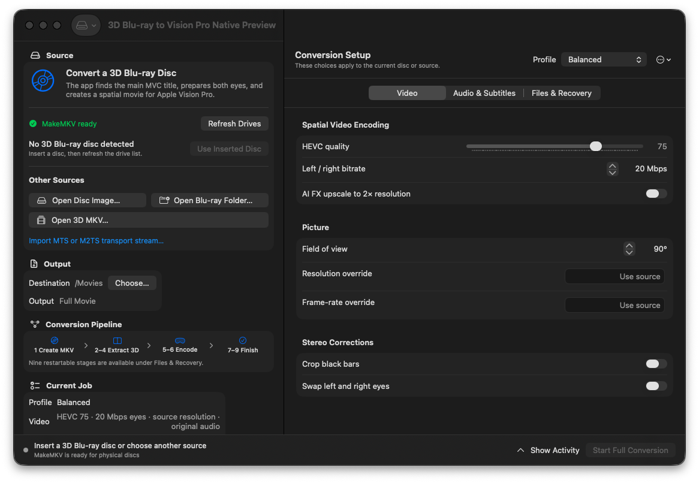
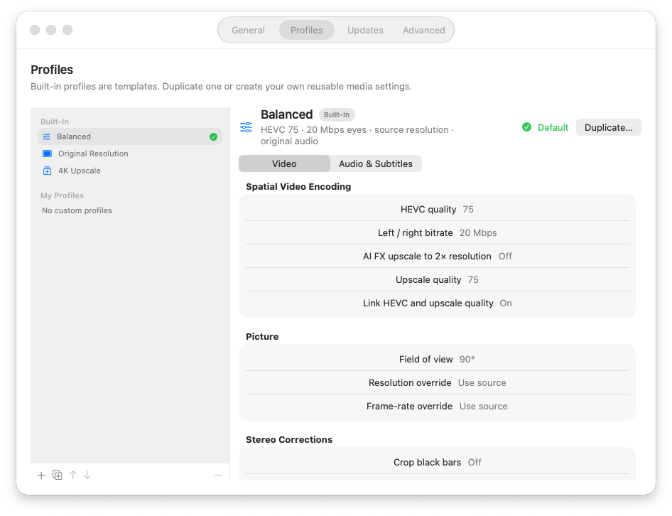
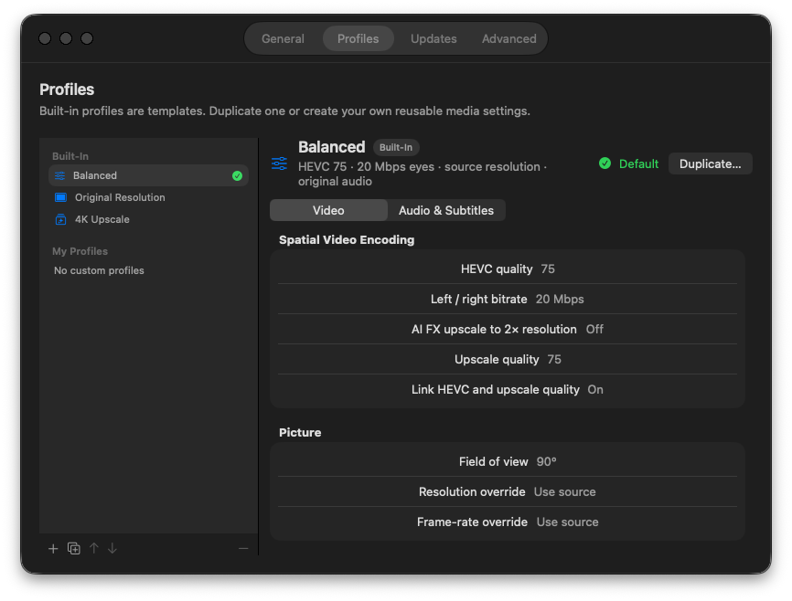

# Native macOS UI Acceptance

This record covers the native SwiftUI/AppKit acceptance pass for issues #178,
#191, and #201. The application deploys to Apple Silicon macOS 26 or later and
was reviewed on the macOS 27 development host with the Xcode 27 SDK on
2026-07-15. The release workflow separately verifies the signed package on a
macOS 26 runner; these screenshots validate layout and platform behavior on the
available interactive host rather than claiming pixel-identical rendering
between major macOS releases.

The production Briefcase screenshots in the repository root remain historical
evidence for the current `0.2.x` release line. Native-interface evidence lives
here until the native app replaces that release line.

## Acceptance Results

| Area | Result | Evidence |
| --- | --- | --- |
| Deployment floor | Pass | XcodeGen and `MACOSX_DEPLOYMENT_TARGET` remain 26.0; package compatibility is enforced separately. |
| Profiles | Pass | Built-ins are immutable; custom profiles support create, duplicate, rename, edit, reorder, delete, default selection, atomic persistence, and corruption recovery. Reordering and duplicate-name progression now have persistence tests. |
| Current-job isolation | Pass | Profile writes contain only reusable encoding settings. Source, destination, preview intent, and job/recovery options remain outside the stored profile. |
| Standard platform controls | Pass | The shell uses native windows, toolbar/menu roles, forms, pickers, lists, split views, materials, and AVKit playback rather than custom replicas. |
| Structural chrome | Pass | Footers use system material normally and switch to an opaque window background for Reduce Transparency or Increase Contrast. No explicit `glassEffect` is applied to dense content. |
| Readability | Pass | Forms and metadata remain opaque; video keeps a black backing; diagnostics use the platform text background. |
| Appearance | Pass | Main and Profiles views were reviewed in light and dark appearances. |
| Accessibility display modes | Pass | Reduce Transparency and Increase Contrast were enabled together for the main-window review and restored afterward. |
| Keyboard and menus | Pass | The standard About, Services, Hide, and Quit items are present; `Command-,` opens the reusable Settings window; sheets retain default and cancel shortcuts. |
| Accessibility semantics | Pass | The Settings accessibility tree exposes named profile controls and navigation tabs. Preview decoration is hidden from assistive technology, the status row has one meaningful label, and the player has an explicit label and hint. |
| Window sizing | Pass | The main window was reviewed at 1120×760. Profiles remained readable and scrollable at the configured 820-point minimum width. |
| Long-running status | Pass | Conversion and preview heartbeats now expose elapsed time while remaining indeterminate when no trustworthy progress denominator exists. |

## Screenshots

### Main Window

| Light | Dark |
| --- | --- |
|  |  |

### Profiles

| Light | Dark |
| --- | --- |
|  |  |

### Accessibility And Minimum Size

| Reduce Transparency + Increase Contrast | Minimum Profiles Window |
| --- | --- |
|  |  |

## Intentional Limits

- No determinate percentage or ETA is shown until a worker stage can provide a
  trustworthy denominator.
- The interactive review used the macOS 27 development host. macOS 26 package
  compatibility remains a release-workflow gate.
- Finalized preview playback is covered by the native AVPlayer flow; growing
  MOV playback remains intentionally unsupported.
